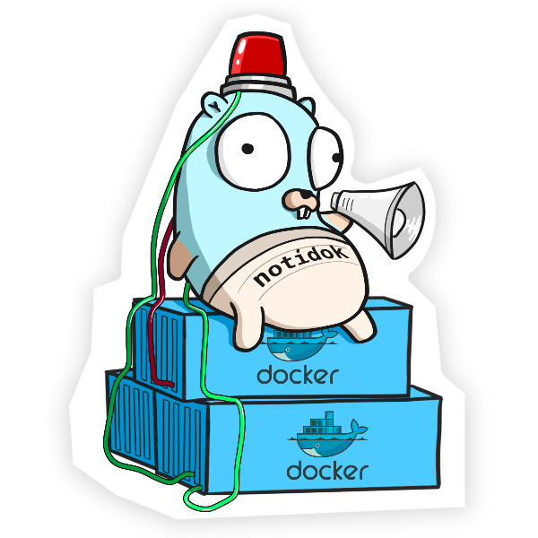

# Notidock
<div style="text-align: center;">
  
</div>

[](https://go.dev/)
[](https://hub.docker.com/r/clasyc/notidock)
[](LICENSE)

Notidock is a secure and lightweight Docker container event monitoring tool that sends notifications to **[Slack](https://slack.com/)**. It watches container lifecycle events with customizable filtering and labeling capabilities.

## Key Features

- **Flexible Monitoring**: Monitor all containers or select specific ones using labels
- **Event Filtering**: Track specific container events (create, start, die, etc.) globally or per container
- **Custom Labeling**: Define custom container names and event filters using Docker labels
- **Security-First**: Runs as non-root with read-only filesystem and minimal privileges
- **Health Monitoring**: Optional container health check monitoring with customizable thresholds
- **Rate Limiting**: Built-in notification throttling to prevent notification floods

## Installation

### Using Docker (Recommended)

```bash
docker run -d \
  --name notidock \
  --network host \
  --read-only \
  --security-opt no-new-privileges=true \
  -v /var/run/docker.sock:/var/run/docker.sock:ro \
  --group-add $(stat -c '%g' /var/run/docker.sock) \
  -e NOTIDOCK_SLACK_WEBHOOK_URL=your_webhook_url \
  clasyc/notidock:latest
```

### Using Docker Compose

```yaml
version: '3.8'

services:
  notidock:
    image: clasyc/notidock:latest
    container_name: notidock
    read_only: true
    security_opt:
      - no-new-privileges:true
    volumes:
      - /var/run/docker.sock:/var/run/docker.sock:ro
    environment:
      - NOTIDOCK_SLACK_WEBHOOK_URL=your_webhook_url
    group_add:
      - "${DOCKER_SOCKET_GID:-0}"  # Will be replaced with actual GID

networks:
  default:
    driver: bridge
```

### Using Binary

```bash
# Download the latest release
curl -L -o ~/.local/bin/notidock \
  https://github.com/Clasyc/notidock/releases/download/v1.2.0/notidock-linux-amd64

# Make it executable
chmod +x ~/.local/bin/notidock

# Run
notidock
```

## Usage Examples

### Monitor Specific Container

```bash
docker run -d \
  --name my-monitored-app \
  --label notidock.include=true \
  --label notidock.name="My Application" \
  --label notidock.events=create,die,oom \
  your-image
```

### Exclude Container from Monitoring

```bash
docker run -d \
  --name background-service \
  --label notidock.exclude=true \
  your-image
```

### Enable Health Monitoring

```bash
docker run -d \
  --name notidock \
  -e NOTIDOCK_MONITOR_HEALTH=true \
  -e NOTIDOCK_HEALTH_TIMEOUT=30s \
  -e NOTIDOCK_MAX_FAILING_STREAK=5 \
  # ... other options ...
  clasyc/notidock
```

## Configuration

### Environment Variables

| Variable | Description | Default |
|----------|-------------|---------|
| `NOTIDOCK_MONITOR_ALL` | Monitor all containers unless excluded | `false` |
| `NOTIDOCK_TRACKED_EVENTS` | Events to track | `create,start,die,stop,kill` |
| `NOTIDOCK_TRACKED_EXITCODES` | Exit codes to track | `""` (all) |
| `NOTIDOCK_SLACK_WEBHOOK_URL` | Slack webhook URL | Required |
| [View all variables](docs/configuration.md#environment-variables) | | |

### Container Labels

| Label | Description |
|-------|-------------|
| `notidock.include` | Include container in monitoring |
| `notidock.exclude` | Exclude from monitoring |
| `notidock.name` | Custom name in notifications |
| [View all labels](docs/configuration.md#container-labels) | |

## Detailed Configuration

For complete configuration options, including:
- All environment variables
- Available container labels
- Event types and their descriptions
- Health monitoring options
- Notification features and throttling
- Security considerations

👉 [View Full Configuration Guide](docs/configuration.md)

## Security Features

- ✅ Non-root user execution
- ✅ Read-only filesystem
- ✅ No new privileges
- ✅ Read-only Docker socket access
- ✅ Minimal base image

## Building from Source

Requirements:
- Go 1.23 or later
- Docker (optional)

```bash
# Clone repository
git clone https://github.com/clasyc/notidock.git
cd notidock

# Build binary
go build -o notidock

# Build Docker image (optional)
docker build -t notidock .
```

## Contributing

Contributions are welcome! Simply fork the repository, create a new branch, and submit a pull request.

## License

This project is licensed under the MIT License - see the [LICENSE](LICENSE.txt) file for details.

## References

- [Docker Engine API](https://docs.docker.com/engine/api/v1.43/)
- [Slack API](https://api.slack.com/messaging/webhooks)

---

<sub>Made by [Clasyc](https://github.com/clasyc)</sub>
